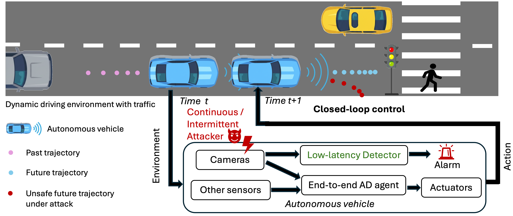

# [WACV 2026, Algorithms Track] AD<sup>2</sup>: Analysis and Detection of Adversarial Threats in Visual Perception for End-to-End Autonomous Driving Systems

<p align="center">
  <h3 align="center">
    <a href="https://"> Paper</a> | <a href="https://ishansahu.com/">Website</a> 
  </h3>
</p>

In this work, we conduct a closed-loop evaluation of state-of-the-art 
autonomous driving agents under black-box adversarial threat models in CARLA. Specifically, we consider three representative attack vectors on the visual perception pipeline: 
1. a physics-based blur attack induced by acoustic waves, 
2. an electromagnetic interference attack that distorts captured images, and
3. a digital attack that adds ghost objects as carefully crafted bounded perturbations on images. 

We experiment with two advanced agents:
1. Transfuser
2. Interfuser

Our study reveals severe vulnerabilities to such attacks, with driving scores
dropping by up to 99% in the worst case, raising valid safety
concerns. To help mitigate such threats, we further propose
a lightweight Attack Detection model for Autonomous Driving systems (AD<sup>2</sup>) based on attention mechanisms that capture spatial–temporal consistency. 

<p align="center">
  
</p>

## Contents
1. [Dependencies](#dependencies)
2. [Setup](#setup)
3. [Usage](#usage)
    - [Evaluation of driving agents](#evaluation-of-driving-agents)
    - [Dataset generation and preparation](#dataset-generation-and-preparation)
    - [Detection model training and testing](#detection-model-training-and-testing)
4. [Acknowledgement](#acknowledgement)
5. [Citations](#citations)

## Dependencies

* carla 0.9.10.1
* leaderboard 1.0
* scenario_runner 0.9.10

For complete list, check the respective requirements.txt file.

## Setup
1. Download carla 0.9.10.1 https://github.com/carla-simulator/carla/releases/tag/0.9.10.1
2. Download this codebase.
3. Create and install the required python enviroment. See docs/setup notes for details.
4. Create two folders results and recordings in the base code folder where simulation results and recordings are saved respectively by default. 
5. In the drivers folder, create a pretrained_models folder and place the downloaded pre-trained agents inside it. Download links for pretrained models:
    - Transfuser agent: https://s3.eu-central-1.amazonaws.com/avg-projects/transfuser/models_2022.zip
    - Interfuser agent: http://43.159.60.142/s/p2CN 

    The links have been taken from the author's original repositories. 
    
    The drivers folder should look something like this.
```
drivers/
├── __init__.py  
├── pretrained_models/
│   ├── interfuser/
│   │   └── interfuser.pth.tar
│   └── transfuser/
│       ├── args.txt  
│       ├── model_seed1_39.pth  
│       ├── model_seed2_39.pth  
│       └── model_seed3_37.pth
├── team_code_interfuser  
└── team_code_transfuser
```

Please check github repos for transfuser https://github.com/autonomousvision/transfuser and interfuser https://github.com/opendilab/InterFuser for more details.


## Usage

### Evaluation of driving agents
1. Start carla server and note its host and port address.
2. Prepare the evaluation experiment config file and the adversarial attack config file. For instructions on config files check experiment_notes.md in docs folder. Already prepared config files and scripts are included in the codebase. Please change the directory paths before using them.
3. Activate the appropriate conda/python environment.
4. Use local_evaluation.sh for ubuntu systems (bash shell) and win_evaluation for windows system (powershell).
5. Execute the following command from the base code directory.
```
./experiments/scripts/local_evaluation.sh <experiment_config_file>
```
For example to evaluate transfuser agent under ESIA execute,
```
./experiments/scripts/local_evaluation.sh experiments/scripts/configs/experiment_transfuser_esia
```
6. After completion of experiment, statistics are saved in the specified file in the experiment config and simulation recording is saved.
7. Using the simulation recording, deviation from centre values for the agent can be computed and plotted using tools/compute_plot_agent_deviation.py. Please use relevant recording filepaths in the code.

### Dataset generation and preparation
1. First execute the datagen simulation. 
For training, we would use routes path "longest6/longest6_split/longest_weathers_19.xml" and for testing we use routes path "longest6/longest6_split/longest_weathers_0.xml". Modify routes path accordingly in config file data_generate_transfuser_polter.

Execution command:
```
./experiments/scripts/local_evaluation.sh experiments/scripts/configs/data_generate_transfuser_polter
```
This would generate clean/benign images and poltergeist perturbed images along with vehicle speed data in a csv file.

2. Now images for ESIA and SNAL attacks can be created using tools/create_esia_data.py and tools/create_snal_data.py from the clean images. Please set appropriate directory paths in the code.
Create images with different severity / eps settings so that they can later be consolidated.
3. Generated images to be arranged properly in different folders for different classes and it should like this:
```
dataset/
├── esia/
│   ├── longest_weathers_0/
│   │   ├── 1
│   │   ├── 2
│   │   ├── 3
│   └── longest_weathers_19/
│       ├── 1
│       ├── 2
│       ├── 3                          
├── original/
│   ├── longest_weathers_0  /
│   │   └── original
│   └── longest_weathers_19/
│       └── original 
├── polter/
│   ├── longest_weathers_0/
│   │   └── polter  
│   └── longest_weathers_19/
│       └── polter
├── snal/
│   ├── longest_weathers_0/
│   │   ├── 4
│   │   ├── 8
│   └── longest_weathers_19  
│   │   ├── 4
│   │   ├── 8
├── longest_weathers_0_speed_records.txt
└── longest_weathers_19_speed_records.txt  
```

4. Now consolidated dataset (combined dataset for ESIA and SNAL for images with different attack hyperparameters in equal distribution) and its corresponding json file can be created using tools/detector_dataset/prepare_carla_adv_dataset.py. Follow the instructions in the python script with appropriate changes to the directory paths.
The dataset directory should look like this:
```
dataset/
├── esia/
│   ├── longest_weathers_0/
│   │   └── combined
│   └── longest_weathers_19/
│       └── combined                               
├── original/
│   ├── longest_weathers_0  /
│   │   └── original
│   └── longest_weathers_19/
│       └── original 
├── polter/
│   ├── longest_weathers_0/
│   │   └── polter  
│   └── longest_weathers_19/
│       └── polter
├── snal/
│   ├── longest_weathers_0/
│   │   └── combined
│   └── longest_weathers_19/
│       └── combined
├── longest_weathers_0_speed_records.txt
└── longest_weathers_19_speed_records.txt 
```

Sample dataset and json files are included in the codebase.

### Detection model training and testing
1. Download/prepare the dataset as described above.
2. Detector model is defined in detector/new_model/detector_model.py
3. Train and evaluate the proposed detector model using detector/new_model/evaluate_detector_model.py python script.

## Acknowledgement
This codebase is based on following codebases:
* Transfuser https://github.com/autonomousvision/transfuser
* Interfuser https://github.com/opendilab/InterFuser  
* Carla Leaderboard 1.0 https://github.com/carla-simulator/leaderboard/tree/leaderboard-1.0
* Scenario Runner https://github.com/carla-simulator/scenario_runner/tree/leaderboard-1.0
* Adversarial Robustness Toolbox https://github.com/Trusted-AI/adversarial-robustness-toolbox 

## Citations
Please cite the following paper for our repository:

```BibTeX
@InProceedings{sahu2026wacv,
  title={{AD$^2$}: Analysis and Detection of Adversarial Threats in Visual Perception for End-to-End Autonomous Driving Systems},
  author={Sahu, Ishan and Hazra, Somnath and Aditya, Somak and Dey, Soumyajit}, 
  booktitle={Proceedings of the Winter Conference on Applications of Computer Vision (WACV)},
  year={2026}
}
```

If you find this repository useful, please consider giving us a star &#127775;.